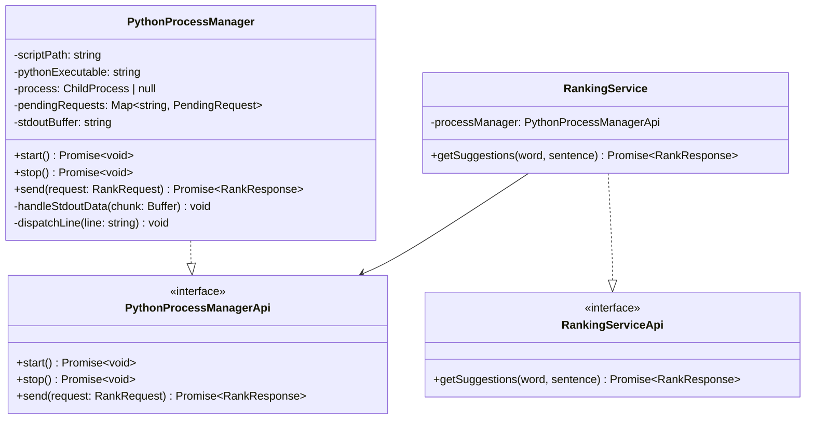

# Thesaurus Plugin — Integration Layer Architecture

## Context

This architecture is only concerned with the following part of the script, which is the api contract between the frontend and the NLP backend.

```bash
.
├── errors
│   └── errors.ts
├── infrastructure
│   └── PythonProcessManager.ts
├── interfaces
│   ├── IPythonProcessManager.ts
│   └── IRankingService.ts
├── services
│   └── RankingService.ts
└── types
    └── types.ts
```

## UML Diagram


